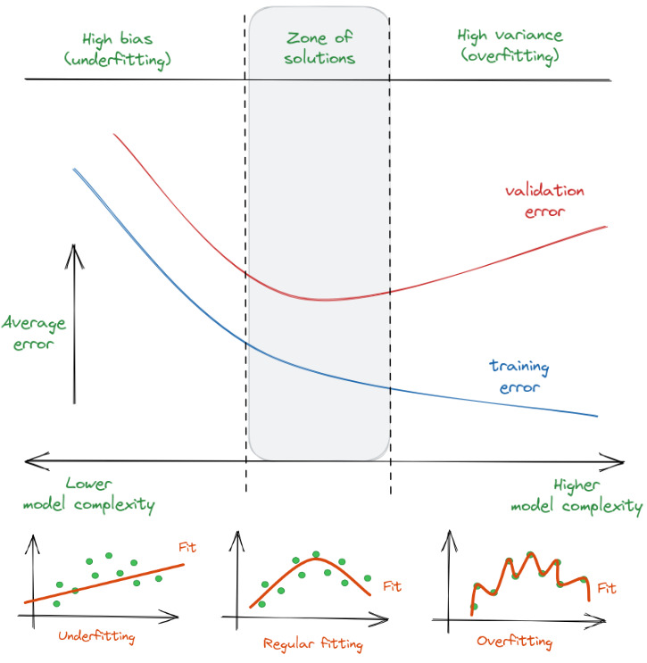

# Machine Learning Fundamentals
## Basic Concepts
### Machine Learning Definition

ML is a subfield of artificial intelligence (AI) that enables systems to learn and improve automatically from data without being explicitly programmed. Through algorithms and mathematical models, machines can identify patterns, make predictions and make decisions based on data. Unlike traditional programming, where explicit rules must be written, in ML the system is fed with data and it generates the rules or relationships necessary for the task.

Types of ML:

- **Supervised Learning**
  - *Definition*: The model learns from labeled data, where each input is associated with a desired output (label). The goal is to predict these labels for new and unseen data.
  - *Example*: Classification of cat and dog images, where each image is labeled as “cat” or “dog”.
  - *When*: Useful when we have a large, labeled dataset, and the goal is to predict accurate results, such as in fraud detection or email classification (spam/non-spam).
  - *Algorithms*: Linear regression, decision trees, SVM, neural networks.

- **Unsupervised Learning**
  - *Definition*: The model works with data that is not labeled. The objective is to discover hidden patterns or structures in the data.
  - *Example*: Clustering to segment customers into groups of similar behavior without knowing in advance what these groups are.
  - *When*: It is useful to discover insights in unknown or unlabeled data, such as in news clustering, market segmentation or dimensionality reduction.
  - *Algorithms*:  K-means, principal component analysis (PCA), autoencoders.

- **Semi-Supervised  Learning**
  - *Definition*:  Combines a small amount of labeled data with a large amount of unlabeled data. The model tries to learn from both.
  - *Example*: Classification of documents where only a small part is labeled as spam or non-spam, but most of the documents are unlabeled.
  - *When*: When manual labeling of large amounts of data is costly or time-consuming, such as in medical image classification.
  - *Algorithms*:  Hybrid models that combine supervised and unsupervised methods, such as SVM with clustering.

- **Self-Supervised  Learning**
  - *Definition*:  A type of supervised learning where labels are automatically generated from data without human intervention. The model creates secondary problems (proxy tasks) to learn useful representations.
  - *Example*: In computer vision, a model can be trained to predict the hidden part of an image given the visible part, using the original image as a label.
  - *When*:  Useful when you have a large amount of unlabeled data but require a robust representation before a supervised task, such as in language models like BERT or GPT.
  - *Algorithms*:  Autoencoders, contrastive learning, pre-trained models such as BERT or GPT.

- **Reinforcement Learning**
  - *Definition*:  The model learns through interactions with an environment. Each action performed is assigned a reward or penalty, and the objective is to maximize the accumulated reward.
  - *Example*: An agent learning to play a video game such as chess or Go, where it receives a reward for winning and a penalty for losing.
  - *When*:  It is useful for problems where a clear objective can be defined and the system can learn through trial and error, such as in games, robotic control or recommender systems.
  - *Algorithms*:  Q-Learning, Deep Q-Networks (DQN), Proximal Policy Optimization (PPO).

- - -
**Summary**

- **Supervised**: When you have a large labeled data set and need accurate predictions.
- **Unsupervised**: When you want to explore or discover patterns in unlabeled data.
- **Semi-Supervised**: When you have little labeled data but a lot of unlabeled data.
- **Self-Supervised**: When you have a large amount of unlabeled data and want to pre-train models with artificial tasks to improve performance.
- **Reinforcement-Based**: When the problem can be defined in terms of rewards and the system can learn by interacting with an environment.
- - -

## Overfitting and Underfitting

- **Underfitting**
  - *Definition*: Underfitting occurs when a model is too simple to capture the underlying patterns in the data. It is not able to learn enough from the training set, resulting in poor performance on both training and test data.
  - *Signals*:
    -  High error in both training and test data.
    - The model fails to capture the complexity of the data set.
    - The learning curve shows that both training error and validation error are high and do not improve with increasing number of iterations.
  - *Prevention*:
    - Increase the complexity of the model:
        If the model is too simple (e.g., a linear model on nonlinear data), you need to increase its complexity. This may include adding more features, using a more sophisticated model (such as neural networks instead of linear regression), or increasing the number of nodes or layers in a neural network.
    - Feature Engineering:
        Create additional features derived from existing features that better capture the structure of the data.
        Use feature extraction techniques such as PCA (Principal Component Analysis) or embeddings in text or image problems.
    - Eliminate constraints:
        In some cases, underfitting can occur because the model is too constrained. For example, if there is excessive regularization (a regularization coefficient L1 or L2 that is too high), this can force the model to be too simple. Reducing the regularization can help to improve the fit.
    - Increase the training time:
        If the model is not trained long enough, it may not have captured the underlying patterns in the data. In neural networks, increasing the number of epochs can improve performance.
    - Add new features:
        If the dataset has few features or information, it may be necessary to incorporate new data sources or transform existing ones to improve performance.
 

- **Overfitting**
  - *Definition*: Occurs when a model is overly complex and overfits the training data, capturing not only the actual patterns, but also noise and peculiarities specific to that data. As a result, the model performs excellently on the training set but fails to generalize to new data.
  - *Signals*:
    - Very low training error, but high test error
    - Too much complexity in the model (too many parameters, too many layers in NN).
    - Difference between training error and validation/test error is large.
    - The learning curve shows that the training error keeps decreasing, but the validation error starts to increase after a certain point.
  - *Prevention*:
    - Cross-Validation:

    Use techniques such as cross-validation (e.g., k-fold cross-validation) to evaluate model performance on different subsets of the data. This helps to obtain a more accurate estimate of model performance and to avoid over-fitting the training set.
    - Regularization:

      Applying penalties to model parameters to limit the complexity of the model.
      L1 Regularization (Lasso): Penalizes the absolute value of the coefficients, inducing some to be zero, which favors simplicity.
      L2 Regularization (Ridge): Penalizes the square of the coefficients, reducing their magnitude without eliminating them completely.
    - Reduce the complexity of the model:

      If the model is too complex for the data set (e.g., a neural network with many layers or a high-degree polynomial regression), it can be simplified by eliminating layers, nodes, or reducing the degree of the polynomial.
    - Early Stopping:

      In neural network training, stopping the training process when the error in the validation set begins to increase (indicating that the model has begun to overfit the training data).
    - Augment the data set:

      Data augmentation in tasks such as computer vision or generating more examples if possible. More data helps mitigate overfitting, as the model has more information to learn generalizable patterns.
    - Dropout (in neural networks):

      Dropout randomly turns off some neurons during training, forcing the network to be more robust and not rely too much on specific neurons, which reduces overfitting.
    - Model Assembly:

      Methods such as bagging (e.g., Random Forest) and boosting (e.g., Gradient Boosting) combine several simpler models to reduce model variance and thus avoid overfitting.

Learning curves (training error and validation error) are a useful tool for detecting and diagnosing overfitting or underfitting problems.

  - Underfitting:
      The training error is high and remains almost the same as the number of samples or iterations increases.
      The validation error is also high and follows the same trend as the training error.
  - Overfitting:
      The training error is low, but the validation error is significantly higher and starts to increase as the model is trained more.

- - -
**Summary**

| Problem | Signals | Solutions |
|---------|---------|-----------|
| Underfitting   | Too simple model, does not capture patterns.  | Increasing model complexity, Feature engineering, Reducing constraints, More training time   |
| Overfitting   |Model too complex, fits to noise.  | Regularization, Cross-validation, Early stopping, Simplifying the model, Dropout, Increasing the data   |

- - -

## Bias-Variance Tradeoff

The Bias-Variance Tradeoff is a central concept in machine learning that describes the tradeoff between two types of errors that a model can make: bias and variance. This tradeoff affects the ability of a model to generalize correctly to new data, i.e. its performance on unseen (test) data.

- **Bias**
  - *Definition*: Bias refers to errors a model makes due to simplifying assumptions it makes about the structure of the problem. A model with high bias underestimates the relationship between input and output variables, leading to poor performance even on the training set.
  - *Consequence*: A high bias causes underfitting, where the model does not capture the underlying relationships in the data, resulting in poor performance on both the training and test data.
  - *Example*: A linear regression model applied to a nonlinear data set would have a high bias because it assumes a linear relationship, ignoring the complexity of the data.
 

- **Variance**
  - *Definition*:  Variance refers to the sensitivity of the model to small variations in the training data. A model with high variance is very close to the training data and captures both the real relationships and the noise present in the training data.
  - *Consequence*: High variance causes overfitting, where the model learns specific details and noise from the training data, resulting in poor performance when generalizing to new data.
  - *Example*: A very high degree polynomial regression model trained on a small data set may fit the training points perfectly, but will perform poorly on new data.

<figure>
  

    
    <figcaption>
    <a href="https://illustrated-machine-learning.github.io/#/machine-learning/bias-variance">Image from illustrated-machine-learning.github.io</a>
  </figcaption>

</figure>

The goal of any machine learning model is to find an appropriate tradeoff between bias and variance to maximize its generalization capability. Reducing bias usually increases variance, and reducing variance usually increases bias. This creates a tradeoff, and the key is to find a middle ground.

The ability of a model to make accurate predictions on unseen (test) data. A model that generalizes well has both relatively low bias and variance, and balances the ability to capture real patterns without adjusting for noise in the training data.

If we plot the total error of a model versus model complexity, we observe two components:

  - Error due to bias: It decreases with increasing model complexity, as more complex models can capture more detailed relationships.
  - Error due to variance: Increases with increasing complexity, as more complex models are also more prone to adjust for noise in the data.

The sum of these errors determines the total error, which initially decreases with model complexity but begins to increase when the model becomes too complex, indicating overfitting.

- **Techniques to Control the Tradeoff:**
  - *Regularization:* Techniques such as L1 (Lasso) and L2 (Ridge) regularization penalize model complexity, reducing variance without increasing bias too much.
  - *Cross-Validation:* Evaluate model performance on different subsets of the data to ensure that it generalizes well and is not over-fitted.
  - *Pruning:* In decision trees, pruning limits the depth of the tree, reducing variance.
  - *Early Stopping:* In neural networks, stopping training when the error in the validation set begins to increase (indicative of overfitting).
  - *Ensemble Models*: Methods such as bagging and boosting (e.g., Random Forest, Gradient Boosting) can combine several models to reduce variance without excessively increasing bias.

- - -
**Summary**

- **Bias**: Errors due to incorrect or oversimplifying assumptions.
- **Variance**: Errors due to excessive sensitivity of the model to variations in the training data.
- **The bias-variance tradeoff** involves finding the right balance to maximize the model's ability to generalize correctly to unseen data, avoiding both underfitting and overfitting.
- - -

## Machine Learning Pipeline

### Exploratory Data Analys (EDA)

 EDA is a crucial step in the machine learning pipeline. It should be included before preprocessing to understand the structure, patterns and peculiarities of the data, which will help you decide which preprocessing and modeling techniques to apply. EDA gives you an overview of the data and allows you to identify issues that could influence the preprocessing phase.

Points of analysis:

- **Distribution of variables:**
  - Are the variables numerical or categorical? What is their range or distribution?
  - Key displays: histograms, boxplots.
  

- **Relationships between variables:**
  - Are there correlations between variables, and what relationships seem important?
  - Key visualizations: correlation matrices, scatter plots, pair plots.

 
- **Distribution of classes (in classification problems):**
  - Is the dataset balanced? If not, consider class balancing techniques.
  - Key visualization: bar charts or pie charts.

 
- **Outliers:**
  - Identification of outliers that could affect the model.
  - Key visualization: boxplots, scatter plots.

 
- **Missing values:**
  - How many and where are there missing values in the dataset?
  - Key visualization: heatmaps of missing values.

With an exploratory data analysis, you can understand the overall behavior of the data and better decide how to clean and transform the data.

Detect early problems: It allows you to identify inconsistencies, missing values, outliers, and class imbalance before applying the necessary transformations.

Guide the preprocessing strategy: Based on the insights from EDA, you can decide which cleaning, normalization, and missing value handling techniques are most appropriate.

It provides a solid foundation for making informed decisions on how to proceed in the machine learning pipeline.

### Data preprocessing

Data preprocessing is a critical step in any machine learning pipeline, as it ensures that the data is in the right format and consistent before being fed into a model.

- **Data cleaning:** 
  - Removing or correcting data that is erroneous, irrelevant or inconsistent.
    - *Removing duplicates:* Many times data may contain duplicate entries that need to be removed.
    - *Format Correction:* Ensuring that values are in the correct format (e.g., dates are in a standardized format).
    - *Treatment of outliers:* These can distort the model. Depending on the case, they can be eliminated, transformed or treated differently.
    
- **Handling missing values:** 
  - Missing values are common in datasets, and it is necessary to deal with them properly to avoid problems in model training..
    - *Removing rows or columns:* If there are too many missing values, it may be better to completely remove the rows or columns that contain them. This is done if the missing data is significant and does not influence the analysis too much.
    - *Imputation of values:* If the missing values are not too many, you can replace them by the mean, median or mode of the column. In more advanced cases, predictive models can be used to estimate missing values.
    - *Use a special value:* In some cases, it is useful to fill missing values with a specific value indicating “not available” or “no data”.

- **Normalization and standardization:**
  - Normalization and standardization are techniques that adjust numerical characteristics to a uniform scale, which may be necessary when different variables have very different ranges of values.
    - *Normalization:* Converts values to a specific range, such as [0,1]. Used when you want to scale features in proportion to their value.
      $$
        X_{\text{norm}} = \frac{X - X_{\text{min}}}{X_{\text{max}} - X_{\text{min}}}
      $$
    - *Standardization (Z-score):* converts the values to a distribution with mean 0 and standard deviation 1. It is useful when the data follow a normal (or approximately normal) distribution.
      $$
        X_{\text{std}} = \frac{X - \mu}{\sigma} 
      $$    
  - These techniques are particularly important for algorithms that depend on the distance between points, such as K-Nearest Neighbors (KNN) or Support Vector Machines (SVM), and also often improve the performance of neural networks.

- **Coding categorical variables:**
  - If you have categorical variables, they must be transformed into a numerical representation. Some techniques include:
    - *One-Hot Encoding:* Creates a new column for each category, assigning 0 or 1 to indicate the presence or absence of the category.
    - *Label Encoding:* Assigns a numeric value to each category. Although useful, it may introduce undesirable ordinal relationships in some circumstances.

These preprocessing techniques ensure that the data are ready to be processed by the models, which can significantly improve the performance and accuracy of the predictions.

### Splitting the dataset

Dividing the dataset into training, validation and test sets is a key step in data preprocessing within the machine learning pipeline. This process ensures that the models are properly evaluated and that they do not overfit the data.

**Training Set**

The training set is the main subset of data used to train the model. The objective of training is to adjust the model parameters (like weights in a neural network) so that it learns patterns from the data.

- Typical size: 60% to 80% of the total available data.
- Purpose: To allow the model to learn relationships between variables (features) and labels (in the case of classification or regression).

The model should not see the validation set or the test set during this phase, to avoid overfitting and for the evaluation to be objective.

**Validation Set**

The validation set is a subset of data that is used to adjust the hyperparameters of the model, i.e. parameters that are not directly adjusted during training, such as the learning rate, the depth of a decision tree, the number of layers of a neural network, etc.

  - Typical size: Between 10% and 20% of the data.
  - Purpose: To evaluate the model during the fitting process and help select the best hyperparameters. It is also used to detect possible over-fitting or under-fitting problems.

- Cross-validation:
  - During the hyperparameter fitting process, you can use techniques such as cross-validation to make the selection more robust by using different splits of the training and validation set.
    - The training set is divided into several “folds” (partitions).
    - The model is trained several times, using different combinations of these folds as training and validation set.
    - The results are averaged to obtain a more stable metric and reduce the risk that the results depend on a specific partition of the data.

  - A common technique is k-fold cross-validation, where the data is divided into kk partitions (folds), and the model is trained kk times, each time using one of the partitions as the validation set and the rest as the training set.

**Test Set**

The test set is a subset of data that is used once to evaluate the final performance of the model after training and validation have been completed.

  - Typical size: Between 10% and 20% of the data.
  - Purpose: To obtain an unbiased assessment of the final model, using data that have not been used for either training or validation. This allows to measure how well the model generalizes to completely new data.

The test set should not be used to adjust any hyperparameters or make any improvements to the model. It is used exclusively as a final performance measure before putting the model into production or using it in a real environment.

**Balance and Stratification**

In classification problems, it is important to ensure that the training, validation and test sets maintain the same distribution of classes as the original dataset. This is done through stratification, ensuring that each set contains approximately the same proportion of labels from each class.

For example, in a binary problem where 30% of the samples have class “1” and 70% have class “0”, each subset should maintain this proportion to avoid bias in training and evaluation.

**Unbalanced classification problem**

It is when one or more classes are much more prevalent than others, models tend to bias towards majority classes, which can lead to poor performance for minority classes. To mitigate this problem, class balancing techniques are employed.

  - **Resampling: Undersampling and Oversampling**
    - These techniques modify the dataset to balance the proportion between majority and minority classes.
      - *Undersampling:*
        - The number of examples of the majority class is reduced to be similar to that of the minority class.
        - Pros: Reduces training time and avoids bias towards the majority class.
        - Cons: May eliminate valuable examples, decreasing the model's ability to generalize.

      - *Oversampling:*
        - Duplicate examples of the minority class are generated to match the size of the majority class.
        - Pros: Keeps all the information of the majority class.
        - Cons: Increases the risk of overfitting, as the model may learn specific patterns from the duplicate examples.

  - **Advanced Oversampling Techniques**
    - To avoid the risk of over-fitting in simple oversampling, there are advanced methods that create new artificial samples instead of duplicating exact examples.
      - *SMOTE (Synthetic Minority Over-sampling Technique):*
        - Generates new synthetic examples of the minority class by interpolating between nearby real samples. SMOTE creates new examples in the feature space, which increases the diversity of the minority class.
        - Pros: Does not simply duplicate examples, which helps to avoid overfitting.
        - Cons: May generate examples that are not fully representative of the actual distribution of the data.

      - *ADASYN (Adaptive Synthetic Sampling):* 
        - Similar to SMOTE, but generates more synthetic examples for minority class points that are closer to the boundary with the majority class, which helps improve performance in difficult decision regions.
        - Pros: Focuses on the more complex regions of the decision boundary.
        - Cons: Like SMOTE, may generate unrepresentative examples.

  - **Adjust class weights**
    - Many machine learning algorithms allow to adjust the weights assigned to each class according to their imbalance. By increasing the weights of minority classes, the model gives them more importance during training.
      - In decision trees, neural networks and SVM: You can assign higher weights to minority classes so that the model penalizes errors in those classes more.
      - In logistic regression and other linear models: You adjust the weights so that the loss function penalizes incorrect predictions of minority classes more.
    - This technique is useful because it does not alter the original dataset, but adjusts how the model interprets the errors.
      - Pros: It does not modify the data. It is very effective in linear and tree-based models.
      - Cons: Depends on the machine learning algorithm to support weight adjustment.

  - **Synthetic sample generation using generative techniques**
    - Techniques such as Variational Autoencoders (VAEs) or Generative Adversarial Networks (GANs) can be used to generate
synthetic samples of the minority class that mimic the distribution of real data.
      - VAEs and GANs: These networks can generate new samples for the minority class based on the features and distribution
    of the original data.
        - Pros: They can generate more realistic and diverse samples than SMOTE.
        - Cons: They require more complex infrastructure and training.

- **Model assembly (Ensemble Methods) for unbalanced classes**
  - Ensemble methods such as Bagging and Boosting can be modified to cope with unbalanced classes. Examples:
    - Balanced Random Forest: This is a variant of Random Forest that uses subsampling in each tree to balance the classes.
    - EasyEnsemble: This method creates multiple balanced subsets of the data by subsampling, trains models on each subset and then combines them into a final model.
    - Pros: They offer a significant improvement in minority class accuracy.
    - Cons: They are more complex and may require more computational resources.

- ** Specialized algorithms for unbalanced classes.**
  - Some algorithms are specifically designed to handle datasets with unbalanced classes. For example:
    - One-Class SVM: It is trained only with examples from one class and then used to detect whether a new example belongs to that class or not. It is useful for problems where minority classes are very rare (such as fraud detection).

- **Adjustment of evaluation metrics**
  - Instead of using metrics such as accuracy (overall precision), which can be misleading in situations of unbalanced classes, other metrics that give more relevance to the correct classification of minority classes should be used:
    - F1-Score: the harmonic average between precision and recall, which penalizes errors in minority classes more heavily.
    - Confusion matrix: Provides a detailed breakdown of hits and errors by class.
    - AUC-ROC: Provides a clearer view of how the model classifies minority versus majority classes.
    - Precision-Recall Curve: Useful for understanding performance in cases of highly unbalanced classes.

- - -
**Summary**
- **Resampling:**
    - Undersampling (Undersampling): Reduces the majority class.
    - Oversampling: Duplicates or generates new samples of the minority class.

- **SMOTE**: Generates synthetic examples by interpolating between samples of the minority class.

- **Class Weights:** Adjusts the class weights in the algorithm to further penalize errors in the minority classes.

- **Synthetic Sample Generation:** Advanced techniques such as VAEs or GANs to create minority class examples.

- **Model Assembly:**
  - Balanced Random Forest: Uses subsampling in each tree.
  - EasyEnsemble: Train models in balanced subsets and combine them.

- **Specialized Algorithms:** Algorithms such as One-Class SVM designed to handle unbalanced data.

- **Adjusted Metrics:** Use metrics such as F1-Score, AUC-ROC and Precision-Recall instead of global accuracy.
- - -

### Model evaluation

Model evaluation is a crucial phase in the life cycle of a Machine Learning (ML) model, since it allows to measure its performance and generalization capacity on unseen data.
These metrics are important for evaluating not only whether a model “gets it right” in predictions, but how and where it fails, helping to adjust the model according to the context of the problem.

#### Confusion matrix

First, let's introduce the confusion matrix. It is a table that allows the performance of a classification model to be evaluated by showing the correct and incorrect predictions made by the model, organized according to the actual and predicted classes. In a binary classification task, the matrix has the following format:

|                     | Predicted Negative (0)  | Predicted Positive  (1) |
|:--------------------|:------------------------|:------------------------|
| Actual Negative (0) | True Negative **(TN)**  | False Positive **(FP)** |
| Actual Positive (1) | False Negative **(FN)** | True Positive **(TP)**  |

- **TP (True Positive):** Cases in which the model predicted positive and were actually positive.
- **FP (False Positive):** Cases in which the model predicted positive, but were negative (false alarms).
- **FN (False Negative):** Cases in which the model predicted negative, but were positive (errors of omission).
- **TN (True Negative):** Cases in which the model predicted negative and were actually negative.

#### Accuracy

Accuracy is the most basic metric, and measures the percentage of correct model predictions out of the total predictions. It is defined as:

$$
Accuracy = \frac{TP + TN}{TP + TN + FP + FN} 
$$

- **Pros**: Easy to understand, useful when classes are balanced.
- **Cons**: In problems with unbalanced classes (when one class is much more frequent than the other), the accuracy can be misleading. For example, if you have 95% negatives and your model always predicts negative, the accuracy would be 95%, but the model is not really learning.

#### Precision

Precision measures the proportion of true positives over the total number of positive predictions. It is useful in situations where it is important to minimize false positives (FP).

$$
Precision = \frac{TP}{TP + FP} 
$$

- **Pros**: Important when false positives are costly (e.g. in medical diagnostics, it is crucial that the positive cases detected are actually positive).
- **Cons**: Does not consider false negatives, so it can be misleading if you care about false negatives.

#### Recall (Sensitivity or True Positive Rate)

Recall measures the proportion of true positives over the total number of true positives. It evaluates how many of the positive cases are correctly identified by the model, being useful when it is important to minimize false negatives (FN).

$$
Recall = \frac{TP}{TP + FN} 
$$

- **Pros**: It is crucial when false negatives have important consequences. For example, in a cancer screening test, it is more important not to miss any positive cases.
- **Cons**: If you optimize too much per recall, you may increase false positives, reducing accuracy.

#### F1-Score

The F1-Score is the harmonic mean of precision and recall. It is a useful metric when you need to find a balance between the two, especially when you have unbalanced classes.

$$
F1 = 2 \times \frac{Precision \times  Recall}{Precision + Recall} 
$$

- **Pros**: Trade-off between precision and recall, useful when there are unbalanced classes and you need a single metric that captures both dimensions.
- **Cons**: Does not give a clear idea of the negative cases. You can have a good F1 score even if your model does not predict negatives correctly.

#### Specificity

Specificity measures the ability of the model to correctly identify negative cases. It is the proportion of true negatives out of the total number of true negatives, and is calculated as:

$$
Specificity = \frac{TN}{TN + FP} 
$$

In other words, it is the rate of true negatives. It is useful in problems where it is important to minimize false positives (FP).

- **Pros**: Very important in contexts where a false positive is costly. For example, in screening for a rare disease, having a high specificity means that you will not mislabel healthy people as diseased.
- **Cons**: By focusing only on negatives, it neglects false negatives, which can be critical in some applications

**Comparison of Specificity and Recall:**

- **Specificity** refers to the rate of true negatives, while recall (also known as sensitivity) refers to the rate of true positives. The two are complementary:
  - *Specificity:* Correct classification rate for negatives.
  - *Recall*: Correct classification rate for positives.
- Both metrics are useful to understand how the model handles both positives and negatives, depending on which is more important to minimize (false positives or false negatives).

####  AUC-ROC (Area Under the Receiver Operating Characteristic Curve)

The AUC-ROC is a metric that evaluates the model's ability to distinguish between positive and negative classes, measuring performance for all possible classification thresholds. The Receiver Operating Characteristic (ROC) curve plots the True Positive Rate (TPR) versus False Positive Rate (FPR) at different thresholds.

- **ROC Curve**: A graph showing how recall and FPR change as you change the decision threshold.
- **AUC (Area Under the Curve)**: This is the area under the ROC curve and varies between 0 and 1. An AUC of 1 indicates a perfect model, and an AUC of 0.5 suggests a model with no discriminatory ability (equivalent to making random predictions).

$$
AUC = \int ROC Curve 
$$

- **Pros**: Useful in unbalanced problems, as it measures the model's ability to classify correctly even when classes are unevenly distributed.
- **Cons**: While it gives a clear idea of the model's overall capability, it can be difficult to interpret and optimize directly.

<figure>
  

    
    <figcaption>
    <a href="https://illustrated-machine-learning.github.io/#/machine-learning/metrics">Image from illustrated-machine-learning.github.io</a>
  </figcaption>

</figure>

####  Precision-Recall Curve

The precision-recall curve is a graphical representation that illustrates the relationship between precision and recall at different classification thresholds. Instead of showing the relationship between True Positive Rate (TPR) and False Positive Rate (FPR) as in the ROC curve, this curve focuses on the relationship between precision and recall.

- Precision: Proportion of positive predictions that are correct.
- Recall: Proportion of positive cases correctly identified.

Interpretation of the curve:

- Axes:
  - *X-axis:* Recall.
  - *Y-axis:* Precision.
- As you increase the threshold for classifying a prediction as positive, recall generally decreases and precision increases, and vice versa.
- A precision-recall curve more towards the upper right corner indicates better performance, i.e., a good balance between precision and recall.

It is particularly useful when classes are unbalanced, which can make the ROC curve less informative. In problems where positive classes are much rarer than negative classes, the precision-recall curve is a more appropriate metric than the ROC curve because it focuses only on the positive cases.

**Area under the precision-recall curve (AUC-PR):**

- Similar to the AUC-ROC, you can calculate the area under the precision-recall curve (AUC-PR). A higher AUC-PR indicates better model performance in terms of precision and recall.

**Comparison between ROC and Precision-Recall:**

- The ROC curve is useful when classes are more balanced, and gives you a complete picture of model performance over all classification thresholds.
- The precision-recall curve is better when the classes are unbalanced, as it focuses you on how the model handles positives.

- - -
**Summary**

- **Confusion matrix:** Essential for understanding all types of model errors.
- **Accuracy:** When classes are balanced and more specific metrics are not as important.
- **Precision**: When false positives are costly (e.g. in spam or fraud classification).
- **Recall:** When false negatives are critical (e.g. in medical diagnostics).
- **F1-Score:** When you want a balance between precision and recall, especially if the classes are unbalanced.
- **Specificity:** Useful for measuring how well the model correctly identifies negatives, reducing false positives.
- **AUC-ROC:** When you are interested in the model's ability to correctly separate classes, regardless of the specific classification threshold.
- **Precision-recall Curve:** Useful for models where positives are rare or costly to misclassify.
- - -

## Machine Learning Fundamentals

     ### Machine Learning Pipeline
        Data preprocessing: cleaning, handling missing values, normalization/standardization.
        Splitting the dataset: training, validation, testing.
        Model evaluation: Accuracy, precision, recall, F1-score, AUC-ROC, etc.

    Supervised Learning Algorithms
        Linear Regression: Understanding the model, assumptions, regularization (Lasso, Ridge).
        Logistic Regression: Binary and multiclass classification.
        K-Nearest Neighbors (KNN): Explanation of the algorithm, distance metrics.
        Decision Trees: Basic concepts, interpretation.
        Random Forest and Bagging: Ensembles and variance reduction.
        Support Vector Machines (SVM): Key concepts, kernel trick.
        Basic Neural Networks: Perceptron, multilayer networks.

    Unsupervised Learning Algorithms
        K-Means Clustering: Clustering algorithm, K choice.
        Hierarchical Clustering Algorithms.
        PCA (Principal Component Analysis): Dimensionality reduction.

## Phase 2: Advancing Techniques and Models

    Regularization and Optimization
        Regularization techniques (L1, L2, dropout).
        Optimization algorithms: Downward gradient, Adam, RMSprop.

    Advanced Models
        Gradient Boosting Machines (GBM): XGBoost, LightGBM.
        Advanced Neural Networks: Convolutional (CNN), recurrent (RNN, LSTM).

    Advanced Techniques
        Sampling techniques: SMOTE, undersampling, oversampling.
        Cross-validation: K-Fold, Stratified K-Fold.
        Hyperparameter tuning: Grid search, random search, Bayesian optimization.
        Ensemble techniques: Stacking, Boosting, Bagging.

## Phase 3: Applied Machine Learning

    Feature Engineering
        Feature selection.
        Creation of new features.
        Coding of categorical variables (One-hot encoding, Label encoding).

    Unbalanced Data Handling
        Adjusting weights in models.
        Resampling and advanced techniques.

    Model Interpretation
        Interpretability: SHAP, LIME, Feature Importance.
        Explaining results to non-experts.

## Phase 4: Advanced Applications and Best Practices

    MLOps and Production
        Implementation of model pipelines.
        Production validation.

    Deep Learning
        Fundamentals of deep networks, frameworks such as TensorFlow or PyTorch (which you already know).
        Distributed training and GPUs.

    Interpretation and Explainability Techniques
        Explainability of models in medical context, ethics and fairness.